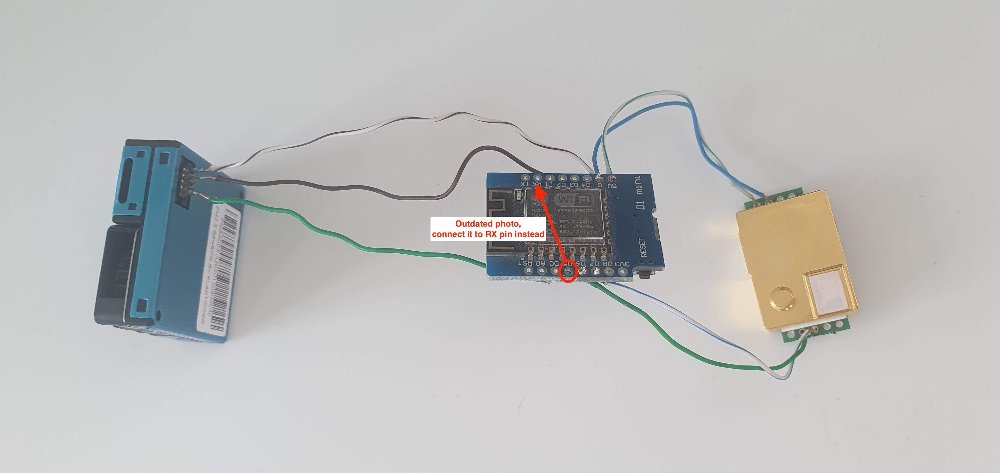
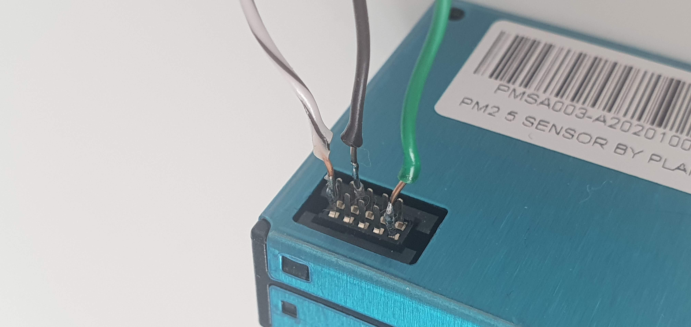
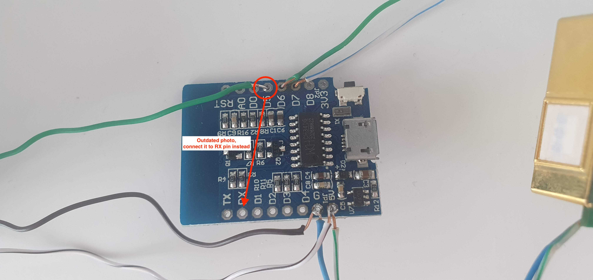
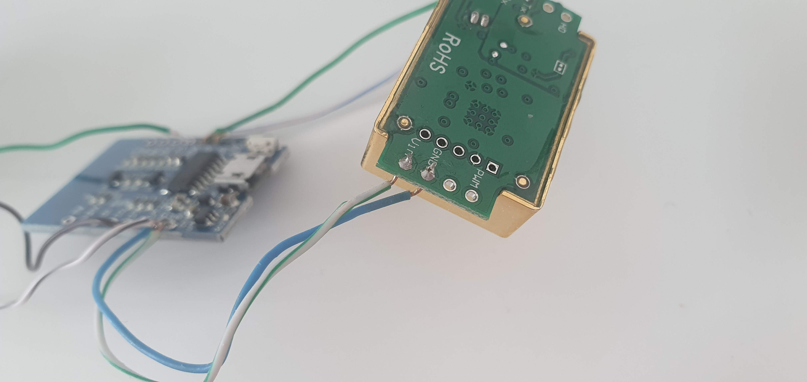
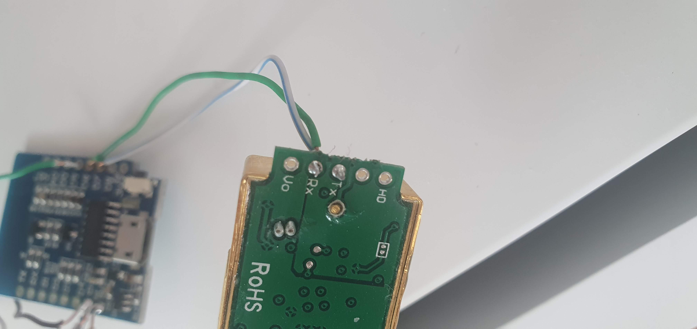
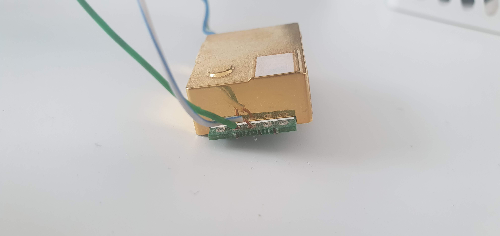

# SR Air Quality

Air quality device based on [Wemos D1 mini](https://www.wemos.cc/en/latest/d1/d1_mini.html) Wi-Fi board, [MH-Z19B](https://revspace.nl/MH-Z19B) CO₂ sensor and [Plantower PMSA003](datasheets/PMSA003.pdf) particle concentration sensor.

## Firmware:

Compiled using [ESPHome](https://esphome.io/). For easy integration into [Home Assistant](https://www.home-assistant.io/).

Instructions on how to compile `base.yaml` into firmware: https://esphome.io/guides/getting_started_command_line.html#first-uploading.

## Measures:

- CO₂ in ppm
- PM 1.0 in µg/m³	
- PM 2.5 in µg/m³	
- PM 10.0 in µg/m³	
- Temperature. I'd not trust it too much, it's from internal temperature sensor of MH-Z19B

## Case for 3D printer

https://www.thingiverse.com/thing:4918099

## Notes

- All PM measurements are throttled to 1 minute to don't overload network/Home Assistant with a lot of useless data. By default PMSA003 sensor sends measurements each 200ms – 2 seconds.
- PMSA003 MUST be connected via hardware UART for stability reasons. Check https://github.com/esphome/issues/issues/2374

## Price

From AliExpress as of 17 July 2021:
- Wemos D1 mini: 2.61$
- MH-Z19B: 18.96$
- PMSA003: 14.9$

Total: *$36.47*

## Photos

Photos of a quite dirty prototype. Just to understand what pins to connect between each other:

